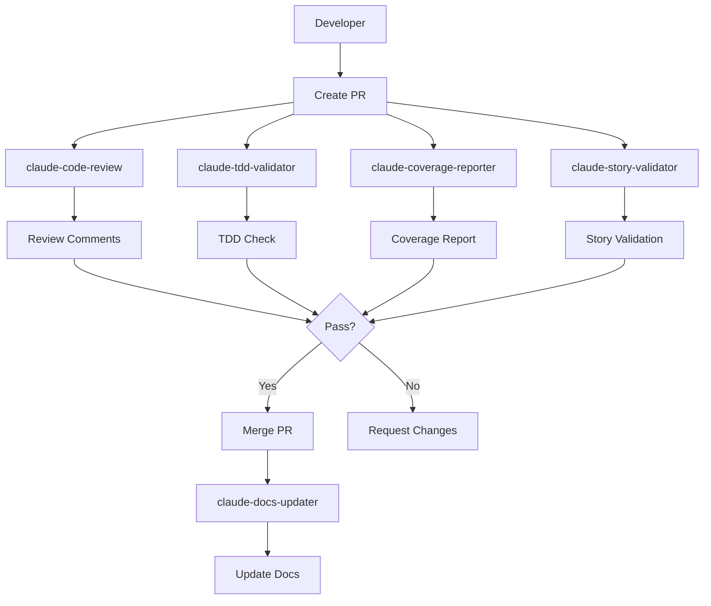

# GitHub Actions Workflows - Everything App

This directory contains Claude-powered GitHub Actions workflows that enforce the BMAD workflow and maintain code quality standards for the Everything App project.

## 🤖 Workflows Overview

### Core Workflows

#### 1. `claude.yml` - Interactive AI Assistant
- **Trigger**: When `@claude` is mentioned in issues or PRs
- **Purpose**: General assistance with development tasks
- **Features**:
  - Responds to mentions in comments
  - Has full project context from CLAUDE.md
  - Can execute development commands
  - Understands virtual team roles

#### 2. `claude-code-review.yml` - Automated PR Review
- **Trigger**: On every PR open/update
- **Purpose**: Comprehensive code review
- **Validates**:
  - Story reference and acceptance criteria
  - TDD compliance (tests written first)
  - Test coverage requirements (Backend: 80%, Frontend: 70%)
  - No TODO/FIXME comments
  - Clean architecture adherence
  - Security best practices
  - Documentation updates

### Quality Assurance Workflows

#### 3. `claude-tdd-validator.yml` - TDD Enforcement
- **Trigger**: On PR with code changes
- **Purpose**: Verify Test-Driven Development was followed
- **Checks**:
  - Commit order (tests before implementation)
  - Test coverage thresholds
  - Test quality (Given-When-Then pattern)
  - Red-Green-Refactor evidence

#### 4. `claude-coverage-reporter.yml` - Coverage Analysis
- **Trigger**: On PR and main branch pushes
- **Purpose**: Detailed test coverage reporting
- **Features**:
  - Runs actual tests for backend and frontend
  - Compares coverage against requirements
  - Identifies uncovered critical paths
  - Suggests specific test cases
  - Blocks PR if coverage drops

### Project Management Workflows

#### 5. `claude-story-validator.yml` - Story Compliance
- **Trigger**: On PR/Issue creation or edit
- **Purpose**: Validate story-driven development
- **Validates**:
  - Story reference format (Story-X.Y.Z)
  - Branch naming convention
  - Acceptance criteria completion
  - Documentation updates

#### 6. `claude-sprint-assistant.yml` - Sprint Management
- **Trigger**: Weekly (Mondays) or manual
- **Purpose**: Automate sprint planning and review
- **Actions**:
  - Plan sprints based on story readiness
  - Review sprint progress
  - Calculate team velocity
  - Organize backlog

#### 7. `claude-daily-standup.yml` - Daily Reports
- **Trigger**: Weekdays at 9 AM UTC
- **Purpose**: Generate daily standup reports
- **Includes**:
  - Yesterday's progress
  - Today's focus
  - Blockers and risks
  - Sprint metrics
  - Action items

#### 8. `claude-docs-updater.yml` - Documentation Sync
- **Trigger**: On main branch changes or manual
- **Purpose**: Keep documentation up-to-date
- **Updates**:
  - Development status
  - API documentation
  - Story statuses
  - Architecture changes
  - README synchronization

## 🚀 Setup Instructions

### 1. Create GitHub Secret

Add your Claude OAuth token as a repository secret:

1. Go to Settings → Secrets and variables → Actions
2. Create new secret: `CLAUDE_CODE_OAUTH_TOKEN`
3. Get token from: https://docs.claude.com/en/docs/claude-code/github-actions

### 2. Enable Workflows

All workflows are enabled by default. To disable any:
- Add `if: false` to the job condition
- Or move the file out of `.github/workflows/`

### 3. Customize Triggers

Modify the `on:` section in each workflow to adjust triggers:
- Add path filters for specific files
- Change schedules for automated workflows
- Add manual `workflow_dispatch` triggers

## 📋 Workflow Interactions



## 🔧 Customization

### Adjusting Review Criteria

Edit the prompts in each workflow to modify review criteria. Key files:
- `claude-code-review.yml`: Main review criteria
- `claude-tdd-validator.yml`: TDD requirements
- `claude-coverage-reporter.yml`: Coverage thresholds

### Adding New Workflows

Create new workflows following this template:

```yaml
name: Claude [Purpose]

on:
  [triggers]

jobs:
  [job-name]:
    runs-on: ubuntu-latest
    permissions:
      contents: read
      [other permissions]

    steps:
      - name: Checkout repository
        uses: actions/checkout@v4

      - name: Run Claude
        uses: anthropics/claude-code-action@v1
        with:
          claude_code_oauth_token: ${{ secrets.CLAUDE_CODE_OAUTH_TOKEN }}
          prompt: |
            [Detailed instructions following CLAUDE.md guidelines]
          claude_args: '[tool permissions]'
```

## 🎯 Best Practices

1. **Keep prompts focused**: Each workflow should have a single clear purpose
2. **Reference CLAUDE.md**: Always remind Claude about project standards
3. **Use appropriate permissions**: Only grant necessary tool access
4. **Test locally first**: Use `act` tool to test workflows locally
5. **Monitor usage**: Check Actions tab for workflow runs and costs

## 🔍 Debugging

### Common Issues

1. **Workflow not triggering**:
   - Check `on:` conditions
   - Verify secret is set
   - Check workflow syntax

2. **Claude not responding correctly**:
   - Review prompt clarity
   - Check CLAUDE.md is up-to-date
   - Verify file paths in prompt

3. **Permission errors**:
   - Check job `permissions:` section
   - Verify `claude_args` tool permissions

### Logs

View workflow runs in the Actions tab for detailed logs of each step.

## 📊 Metrics

Track workflow effectiveness:
- PR review time reduction
- Test coverage trends
- Story completion rates
- Documentation accuracy

## 🤝 Contributing

When adding new workflows:
1. Follow existing naming convention
2. Update this README
3. Test thoroughly
4. Document in CLAUDE.md if it affects development process

---

**Note**: These workflows are designed to support the BMAD (Business Modeling Agile Development) methodology and enforce TDD practices. They work together to maintain high code quality and project documentation standards.