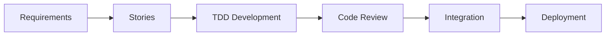

# Everything App 🏠

> A comprehensive personal and family financial management platform built with enterprise-grade architecture

[](https://spring.io/projects/spring-boot)
[](https://flutter.dev)
[](https://openjdk.org)
[](https://www.postgresql.org)
[](docs/architecture/workflow.md)

## 📋 Overview

Everything App is a **family financial management system** designed to help households track expenses, manage budgets, and achieve financial goals together. Built with a modern microservices-ready architecture, it combines the power of Spring Boot backend with Flutter's cross-platform capabilities.

### Key Features

- 💰 **Multi-Account Management** - Track checking, savings, and credit accounts
- 📊 **Smart Budgeting** - Create and monitor budgets with real-time alerts
- 🔐 **Secure Authentication** - JWT tokens with refresh rotation and rate limiting
- 👨‍👩‍👧‍👦 **Family Collaboration** - Multiple users with role-based permissions
- 📈 **Analytics Dashboard** - Visualize spending patterns and trends
- 🔄 **Transaction Management** - Quick entry with smart categorization

## 🏗️ Architecture

This project follows **Domain-Driven Design (DDD)** principles with clean architecture:

```
everything-app/
├── 📦 backend/             # Spring Boot API (Modular Monolith)
│   ├── domain/            # Business logic & entities
│   ├── application/       # Use cases & services
│   ├── infrastructure/    # Database & external services
│   └── presentation/      # REST controllers
├── 📱 frontend/           # Flutter cross-platform app
│   ├── features/          # Feature-based modules
│   ├── core/             # Shared infrastructure
│   └── shared/           # Reusable components
├── 📚 docs/              # Comprehensive documentation
│   ├── architecture/     # Technical design docs
│   ├── stories/          # User stories (38 items)
│   └── prd.md           # Product requirements
└── 🔧 .bmad-core/       # BMAD workflow automation
```

## 🚀 Quick Start

### Prerequisites

| Tool | Version | Purpose |
|------|---------|---------|
| Java | 25 | Backend runtime |
| Maven | 3.9+ | Build orchestration |
| Flutter | 3.35.4 | Frontend framework |
| Docker | Latest | Database & services |
| Node.js | 18+ (optional) | Additional tooling |

### 1️⃣ Clone & Setup

```bash
# Clone the repository
git clone https://github.com/caioniehues/everything-app.git
cd everything-app

# Install BMAD workflow (optional but recommended)
./.bmad-core/install.sh
```

### 2️⃣ Backend Development

```bash
# Start PostgreSQL and pgAdmin
cd backend
docker compose up -d

# Run database migrations
./mvnw liquibase:update

# Run the backend application
./mvnw spring-boot:run

# Run tests with coverage
./mvnw test jacoco:report
```

Backend API will be available at `http://localhost:8080`

### 3️⃣ Frontend Development

```bash
# Install dependencies
cd frontend
flutter pub get

# Run on web (fastest for development)
flutter run -d chrome

# Run on desktop
flutter run -d linux   # or macos/windows

# Run tests with coverage
flutter test --coverage
```

### 4️⃣ Full Stack Development

```bash
# From project root - start everything
make dev     # Starts backend + frontend + database

# Or manually:
cd backend && docker compose up -d && ./mvnw spring-boot:run &
cd frontend && flutter run -d chrome
```

## 💻 Tech Stack

### Backend
| Technology | Purpose | Version |
|------------|---------|---------|
| Spring Boot | Framework | 3.5.6 |
| Java | Language | 25 |
| PostgreSQL | Database | 15 |
| Liquibase | Migrations | Latest |
| JWT | Authentication | 0.12.3 |
| TestContainers | Testing | 1.19+ |
| Docker | Containerization | Latest |

### Frontend
| Technology | Purpose | Version |
|------------|---------|---------|
| Flutter | Framework | 3.35.4 |
| Dart | Language | 3.9.2 |
| Riverpod | State Management | 2.0 |
| go_router | Navigation | Latest |
| Dio | HTTP Client | 5.0+ |
| Hive | Local Storage | 2.0+ |
| fl_chart | Visualizations | Latest |

## 📈 Development Status

### Current Sprint Progress
- **Epic 1**: Foundation & Authentication (In Progress)
  - ✅ Backend Infrastructure (Complete)
  - 🔄 Flutter Setup (5 sub-stories created)
  - 🔄 Authentication API (5 sub-stories created)
- **Total Stories**: 38 items (17 sharded from 4 oversized stories)
- **Estimated Timeline**: 10 weeks to MVP

### Next Milestones
1. **Week 1-3**: Complete authentication system
2. **Week 4-6**: Implement account management
3. **Week 7-8**: Add transaction features
4. **Week 9-10**: Dashboard and analytics

## 📖 Documentation

### Key Documents
- 📋 [Product Requirements Document](docs/prd.md) - Vision and user stories
- 🏛️ [Architecture Overview](docs/architecture.md) - Technical design decisions
- 📊 [Development Status](docs/development-status.md) - Current progress
- 📚 [API Documentation](docs/api/README.md) - Endpoint specifications
- 🎯 [User Stories](docs/stories/epic-story-summary.md) - Complete story inventory

### Architecture Documents
- [Coding Standards](docs/architecture/coding-standards.md)
- [Frontend Architecture](docs/architecture/frontend-architecture.md)
- [Tech Stack Decisions](docs/architecture/tech-stack.md)
- [Source Tree Structure](docs/architecture/source-tree.md)
- [BMAD Workflow](docs/architecture/workflow.md)

## 🔧 Development Workflow

This project follows the **BMAD (Business Modeling Agile Development)** workflow:



### Development Principles
- ✅ **Test-Driven Development** - Write tests first
- ✅ **Clean Architecture** - Domain-driven design
- ✅ **Code Quality** - 80% test coverage minimum
- ✅ **No TODOs** - Complete features or don't merge
- ✅ **Continuous Integration** - Automated testing on every push

## ⚙️ Configuration

### Environment Variables

Create `.env` files in both backend and frontend directories:

**Backend** (`backend/.env`):
```properties
# JWT Configuration
JWT_SECRET=your-256-bit-secret-key-for-production
JWT_ACCESS_EXPIRY=900000    # 15 minutes
JWT_REFRESH_EXPIRY=604800000 # 7 days

# Database (if not using Docker)
DB_HOST=localhost
DB_PORT=5432
DB_NAME=everythingapp
DB_USER=appuser
DB_PASSWORD=apppassword

# Application
SERVER_PORT=8080
SPRING_PROFILES_ACTIVE=dev
```

**Frontend** (`frontend/.env`):
```properties
# API Configuration
API_BASE_URL=http://localhost:8080
API_TIMEOUT=30000

# Feature Flags
ENABLE_ANALYTICS=true
ENABLE_DEBUG_MODE=true
```

### Docker Services

| Service | Port | Credentials |
|---------|------|-------------|
| PostgreSQL | 5432 | appuser/apppassword |
| pgAdmin | 5050 | admin@everything.app/admin |
| Redis (future) | 6379 | - |

## 🧪 Testing Strategy

### Coverage Goals
- **Backend**: 80% minimum (90% for critical paths)
- **Frontend**: 70% minimum (80% for business logic)

### Test Pyramid
```
         /\
        /  \  E2E Tests (10%)
       /    \
      /      \  Integration Tests (30%)
     /        \
    /__________\  Unit Tests (60%)
```

### Running Tests

```bash
# Backend - All tests with coverage
cd backend
./mvnw clean test jacoco:report
# Coverage report: target/site/jacoco/index.html

# Frontend - All tests with coverage
cd frontend
flutter test --coverage
lcov --list coverage/lcov.info

# E2E Tests (coming soon)
npm run test:e2e
```

## 🤝 Contributing

### Development Process

1. **Pick a Story**: Choose from [epic-story-summary.md](docs/stories/epic-story-summary.md)
2. **Create Branch**: `feature/story-x.x-brief-description`
3. **Write Tests First**: Follow TDD approach
4. **Implement Feature**: Make tests pass
5. **Document Changes**: Update relevant docs
6. **Submit PR**: Include story reference

### Commit Convention

```
type(scope): description

[Story-X.X] Detailed explanation

Co-Authored-By: Name <email>
```

Types: `feat`, `fix`, `docs`, `style`, `refactor`, `test`, `chore`

### Code Standards

- Follow [Coding Standards](docs/architecture/coding-standards.md)
- No `TODO` or `FIXME` comments
- Maintain test coverage requirements
- Use provided formatters and linters

## 🔗 Resources

### Internal Documentation
- [Architecture Decision Records](docs/architecture/adr/)
- [UI/UX Specifications](docs/architecture/ui-specification.md)
- [API Contracts](docs/api/contracts/)
- [Security Guidelines](docs/security/)

### External Resources
- [Spring Boot Documentation](https://docs.spring.io/spring-boot/)
- [Flutter Documentation](https://docs.flutter.dev/)
- [BMAD Methodology](https://bmad.io)
- [Clean Architecture](https://blog.cleancoder.com/uncle-bob/2012/08/13/the-clean-architecture.html)

## 📝 License

**Private Repository** - Family use only. Not for public distribution.

## 👥 Team

- **Caio Niehues** - Project Owner & Lead Developer
- **Sarah** - Product Owner (Virtual)
- **Winston** - System Architect (Virtual)
- **Ruby** - Backend Developer (Virtual)

---

<p align="center">
Built with ❤️ for better family financial management
</p>