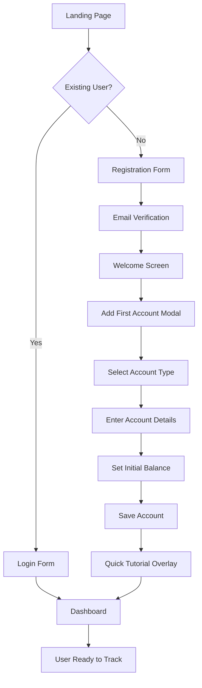

# Everything App UI/UX Specification

## Introduction

This document defines the user experience goals, information architecture, user flows, and visual design specifications for Everything App's user interface. It serves as the foundation for visual design and frontend development, ensuring a cohesive and user-centered experience.

### Overall UX Goals & Principles

#### Target User Personas

1. **Family Financial Manager:** Primary household member who manages day-to-day finances, creates budgets, and monitors spending patterns. Needs intuitive transaction entry and clear budget visualizations.

2. **Family Member - Contributor:** Secondary users who track their own expenses and view shared budgets. Requires simplified interfaces and clear permission boundaries.

3. **Power User - Financial Optimizer:** Tech-savvy user who imports bank data, analyzes trends, and uses advanced features. Values efficiency, keyboard shortcuts, and data export capabilities.

#### Usability Goals

- **5-Minute Onboarding:** New users can add their first account and transaction within 5 minutes
- **One-Tap Transaction Entry:** Most common transactions can be added with minimal interaction
- **Instant Budget Feedback:** Real-time updates show budget impact immediately after transaction entry
- **Cross-Device Continuity:** Seamless experience whether on mobile, tablet, or desktop
- **Offline-First Reliability:** Core functions work without internet, sync when connected

#### Design Principles

1. **Financial Clarity First** - Every number, chart, and indicator must be immediately understandable
2. **Trust Through Transparency** - Show calculation methods, data sources, and sync status clearly
3. **Progressive Complexity** - Simple by default, powerful when needed
4. **Delightful Efficiency** - Common tasks should feel effortless and satisfying
5. **Family-Safe Design** - Role-based views ensure appropriate access without confusion

### Change Log

| Date                | Version | Description                    | Author            |
|---------------------|---------|--------------------------------|-------------------|
| 21/09/2025 00:27:25 | 1.0.0   | Initial specification creation | Sally (UX Expert) |

## Information Architecture (IA)

### Site Map / Screen Inventory

### Navigation Structure

**Primary Navigation:** Bottom navigation bar on mobile (max 5 items), side navigation drawer on desktop. Contains: Dashboard, Accounts, Transactions, Budgets, More (Analytics/Settings)

**Secondary Navigation:** Contextual tabs within each primary section. For example, within Accounts: "All Accounts", "By Type", "Hidden"

**Breadcrumb Strategy:** Show path on desktop for deep navigation (e.g., Settings > Categories > Edit Category). On mobile, use back arrow with section title.

**Quick Actions:** Floating Action Button (FAB) on mobile for new transaction, persistent quick-add bar on desktop

## User Flows

### Flow 1: First-Time User Onboarding

**User Goal:** Set up account and add first financial account

**Entry Points:** App installation, registration link, family member invitation

**Success Criteria:** User has created account, added at least one financial account, and viewed dashboard

**Edge Cases & Error Handling:**
- Email already registered → Show login prompt with password reset option
- Weak password → Real-time validation with requirements checklist
- Network failure during registration → Save form data locally, retry with notification
- Skip account creation → Allow but show empty state prompting to add account

**Notes:** The 5-minute onboarding goal requires minimal fields, smart defaults, and the option to skip non-essential steps

### Flow 2: Quick Transaction Entry

**User Goal:** Add a new expense/income transaction quickly

**Entry Points:** FAB on any screen, quick-add bar on desktop, widget shortcut, dashboard quick action

**Success Criteria:** Transaction saved with minimal interaction, budget updated immediately

**Edge Cases & Error Handling:**
- Insufficient funds → Warning but allow (overdraft tracking)
- No accounts exist → Prompt to create account first
- Offline mode → Save locally with sync indicator
- Duplicate detection → Show similar recent transactions for confirmation

**Notes:** Optimized for speed with smart defaults, recent categories, and one-tap save for common transactions

### Flow 3: Authentication & Session Management

**User Goal:** Securely access account with minimal friction

**Entry Points:** App launch, session timeout, explicit logout

**Success Criteria:** User authenticated with appropriate role permissions

**Edge Cases & Error Handling:**
- Invalid credentials → Show error with attempt counter (5 max)
- Rate limited → Show cooldown timer
- Network failure → Queue request, show offline mode
- Refresh fails → Force re-authentication gracefully

**Notes:** Balance security with convenience through refresh tokens

## Wireframes & Mockups

**Primary Design Files:** Figma designs to be created at: [Project Figma Link - TBD]

### Key Screen Layouts

#### Dashboard Screen

**Purpose:** Central hub providing financial overview and quick access to all features

**Key Elements:**
- Header: Net worth display with trend indicator, notification bell, settings gear
- Account Cards Section: Horizontal scrollable list showing name, balance, type icon
- Quick Actions Bar: Add Transaction, Transfer, Pay Bill buttons
- Budget Progress Widget: Circular progress indicators for top 3 budget categories
- Recent Transactions List: Last 5 transactions with amount, category, merchant
- Insights Card: AI-generated tip or spending alert
- Bottom Navigation: 5 items with active state indicator

**Interaction Notes:** Pull-to-refresh updates all data. Cards are tappable for details. Swipe on transaction for quick edit/delete.

**Design File Reference:** Dashboard_Mobile_v1, Dashboard_Desktop_v1

#### Add Transaction Screen

**Purpose:** Rapid transaction entry with minimal friction

**Key Elements:**
- Amount Input (Top): Large numpad-style calculator with running total
- Type Toggle: Income/Expense switcher with color change
- Category Grid: 3x3 grid of recent/favorite categories with icons
- Account Selector: Dropdown showing account name and current balance
- Date Field: Today by default, tap to change via calendar picker
- Description Field: Optional text input with merchant autocomplete
- Photo Attachment: Camera icon for receipt capture
- Save Button: Full-width primary action button

**Interaction Notes:** Amount field auto-focuses on open. Categories show usage frequency. Swipe between number pad and full keyboard.

**Design File Reference:** AddTransaction_QuickMode_v1, AddTransaction_DetailMode_v1

#### Login Screen

**Purpose:** Secure authentication with clear visual hierarchy

**Key Elements:**
- App Logo & Title: Centered at top, scales with screen size
- Welcome Message: Contextual (Welcome back/Get started)
- Email Field: With email keyboard and validation
- Password Field: With visibility toggle and forgot password link
- Remember Me Checkbox: Left-aligned with helper text
- Login Button: Full-width primary button with loading state
- Divider: "OR" separator
- Register Link: Secondary action button
- Security Badge: "Your data is encrypted" with lock icon

**Interaction Notes:** Auto-advance from email to password field. Show inline validation. Loading overlay during authentication.

**Design File Reference:** Auth_Login_v1, Auth_Register_v1

## Component Library / Design System

**Design System Approach:** Material Design 3 (Material You) with custom financial components. Use Flutter's built-in Material components as the foundation, with custom extensions for finance-specific needs.

### Core Components

#### Account Card Component

**Purpose:** Display financial account information in a scannable, consistent format

**Variants:** Standard (with balance), Compact (name and balance only), Detailed (with recent activity sparkline), Hidden balance (for privacy mode)

**States:** Default, Selected, Disabled (inactive accounts), Loading, Error

**Usage Guidelines:** Use standard variant in dashboard, compact in lists, detailed in account overview. Always show currency symbol. Format large numbers with commas. Use color coding: green for positive, red for negative/credit.

#### Transaction List Item Component

**Purpose:** Display individual transactions with all essential information at a glance

**Variants:** Default (icon, description, amount), Expanded (includes account, date, category), Pending (dotted border), Grouped (split transactions)

**States:** Default, Selected, Swiping (reveals actions), Loading, Syncing

**Usage Guidelines:** Always show amount prominently. Use category icons for quick recognition. Group by date with sticky headers. Show pending with visual distinction.

#### Budget Progress Ring Component

**Purpose:** Visualize budget consumption with clear remaining amount

**Variants:** Circular (dashboard widgets), Linear (lists), Mini (inline display), Detailed (with amount labels)

**States:** Under budget (green), Warning (75-90%, yellow), Over budget (red), No budget set (gray)

**Usage Guidelines:** Always show percentage and absolute values. Use animation for value changes. Include period remaining. Show projected overspend when applicable.

#### Quick Action Button Component

**Purpose:** Provide fast access to common financial actions

**Variants:** FAB (floating action button), Chip (inline compact), Card (with icon and label), Menu item (in dropdown)

**States:** Default, Pressed, Disabled, Loading

**Usage Guidelines:** Prioritize most frequent actions. Use clear icons with labels. Show loading state during action. Provide haptic feedback on press.

#### Amount Input Component

**Purpose:** Specialized number input for financial amounts

**Variants:** Calculator style (with operators), Simple (number pad only), Inline (for forms), Split amount (for shared expenses)

**States:** Empty, Entering, Valid, Invalid (exceeds limits), Calculating

**Usage Guidelines:** Auto-format with currency symbol. Support decimal to 2 places. Show running total for calculator variant. Allow quick operations (+, -, *, /).

## Branding & Style Guide

### Visual Identity

**Brand Guidelines:** Material Design 3 with custom financial theming. Focus on trust, clarity, and family-friendliness.

### Color Palette

| Color Type | Hex Code                           | Usage                                               |
|------------|------------------------------------|-----------------------------------------------------|
| Primary    | #1976D2                            | Main brand color, primary buttons, active states    |
| Secondary  | #00796B                            | Accent elements, success states, positive trends    |
| Accent     | #FF6F00                            | Call-to-action, notifications, important highlights |
| Success    | #4CAF50                            | Positive feedback, income, savings goals met        |
| Warning    | #FF9800                            | Cautions, budget warnings at 75-90%                 |
| Error      | #F44336                            | Errors, overspending, failed validations            |
| Neutral    | #212121, #757575, #E0E0E0, #FAFAFA | Text, borders, backgrounds (dark to light)          |

### Typography

#### Font Families
- **Primary:** Roboto (system default for Material Design)
- **Secondary:** Roboto Slab (for emphasis and headers)
- **Monospace:** Roboto Mono (for amounts and numbers)

#### Type Scale

| Element | Size | Weight        | Line Height |
|---------|------|---------------|-------------|
| H1      | 32sp | Medium (500)  | 40sp        |
| H2      | 24sp | Medium (500)  | 32sp        |
| H3      | 20sp | Medium (500)  | 28sp        |
| Body    | 16sp | Regular (400) | 24sp        |
| Small   | 14sp | Regular (400) | 20sp        |

### Iconography

**Icon Library:** Material Icons (Material Symbols) with custom financial icons where needed

**Usage Guidelines:** Use filled icons for active/selected states, outlined for inactive. Maintain 24dp standard size. Custom icons for: budget ring, split transaction, recurring payment.

### Spacing & Layout

**Grid System:** 8dp grid system with 16dp as primary unit

**Spacing Scale:** 4dp, 8dp, 12dp, 16dp, 24dp, 32dp, 48dp, 64dp

## Animation & Micro-interactions

### Motion Principles

Motion with Purpose - Every animation serves a functional goal: provide feedback, guide attention, or reveal relationships.

### Key Animations

- **Balance Updates:** Count animation (600ms, easeOutCubic) with color pulse for increase/decrease
- **Budget Progress:** Elastic fill (800ms) with color transitions at thresholds, haptic feedback
- **Transaction Success:** Three-phase sequence - checkmark draw (300ms), ripple (400ms), slide (200ms)
- **Pull-to-Refresh:** Elastic overscroll with staggered card animations (100ms between items)
- **Error States:** Horizontal shake (500ms, 3 oscillations) with red border pulse
- **Swipe Actions:** 30% drag threshold with rubberbanding, undo snackbar for 3 seconds
- **Loading States:** Skeleton with shimmer effect (1500ms loop), content fade-in (300ms)

## Responsiveness Strategy

### Breakpoints

| Breakpoint | Min Width | Max Width | Target Devices              |
|------------|-----------|-----------|-----------------------------|
| Mobile     | 0px       | 599px     | Phones                      |
| Tablet     | 600px     | 899px     | Small tablets, large phones |
| Desktop    | 900px     | 1199px    | Tablets, small laptops      |
| Wide       | 1200px    | -         | Desktop monitors            |

### Adaptation Patterns

**Layout Changes:** Single column on mobile → Two columns on tablet → Multi-column grid on desktop. Navigation shifts from bottom bar (mobile) to side drawer (desktop).

**Navigation Changes:** Bottom navigation for mobile (5 items max), hamburger menu for tablet, permanent side navigation for desktop.

**Content Priority:** Dashboard widgets stack vertically on mobile, 2x2 grid on tablet, customizable grid on desktop. Transaction lists show essential info on mobile, expand to show all details on desktop.

**Interaction Changes:** Swipe gestures on mobile, hover states on desktop, right-click context menus on desktop only.

## Performance Considerations

### Performance Goals
- **Page Load:** Initial load under 3 seconds on 3G
- **Interaction Response:** UI feedback within 100ms
- **Animation FPS:** Maintain 60 FPS for all animations

### Design Strategies
- Lazy load images and heavy components
- Use skeleton screens during data fetching
- Implement virtual scrolling for long lists (100+ items)
- Progressive data loading (show cached data first, then update)
- Optimize bundle size with code splitting
- Use Flutter's const constructors for widget optimization

## Next Steps

### Immediate Actions
1. Review specification with stakeholders for alignment
2. Create high-fidelity mockups in Figma based on this spec
3. Develop Flutter component library with defined components
4. Implement Story 1.2 (Flutter Setup) using this specification
5. Create design tokens file for consistent theming

### Design Handoff Checklist
- [x] All user flows documented
- [x] Component inventory complete
- [x] Responsive strategy clear
- [x] Brand guidelines incorporated
- [x] Performance goals established
- [ ] Figma designs created
- [ ] Design tokens exported
- [ ] Component documentation written

---
End of UI/UX Specification v1.0.0