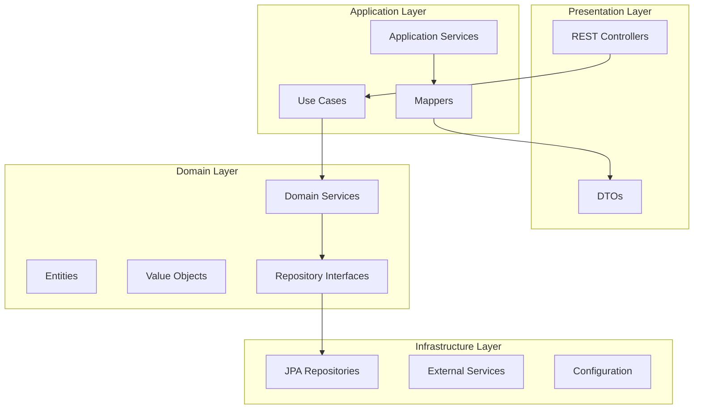
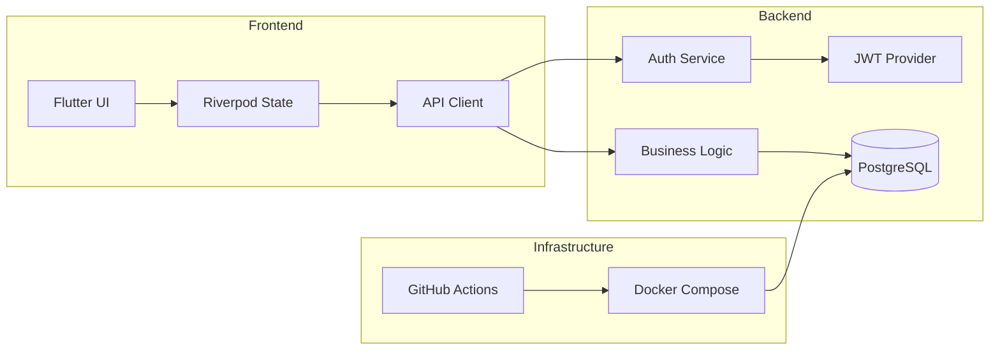

# System Architecture Diagrams

Generated: $(date '+%d/%m/%Y %H:%M:%S')

## Clean Architecture Layers

```mermaid
graph TB
    subgraph "Presentation Layer"
        REST[REST Controllers]
        DTO[DTOs]
    end

    subgraph "Application Layer"
        UC[Use Cases]
        AS[Application Services]
        MAP[Mappers]
    end

    subgraph "Domain Layer"
        ENT[Entities]
        VO[Value Objects]
        REPO[Repository Interfaces]
        DS[Domain Services]
    end

    subgraph "Infrastructure Layer"
        JPA[JPA Repositories]
        EXT[External Services]
        CONF[Configuration]
    end

    REST --> UC
    UC --> DS
    DS --> REPO
    REPO --> JPA
    AS --> MAP
    MAP --> DTO
```

## Component Dependencies

```mermaid
graph LR
    subgraph Frontend
        UI[Flutter UI] --> STATE[Riverpod State]
        STATE --> API[API Client]
    end

    subgraph Backend
        API --> AUTH[Auth Service]
        AUTH --> JWT[JWT Provider]
        API --> BIZ[Business Logic]
        BIZ --> DB[(PostgreSQL)]
    end

    subgraph Infrastructure
        DOCKER[Docker Compose] --> DB
        GH[GitHub Actions] --> DOCKER
    end
```
